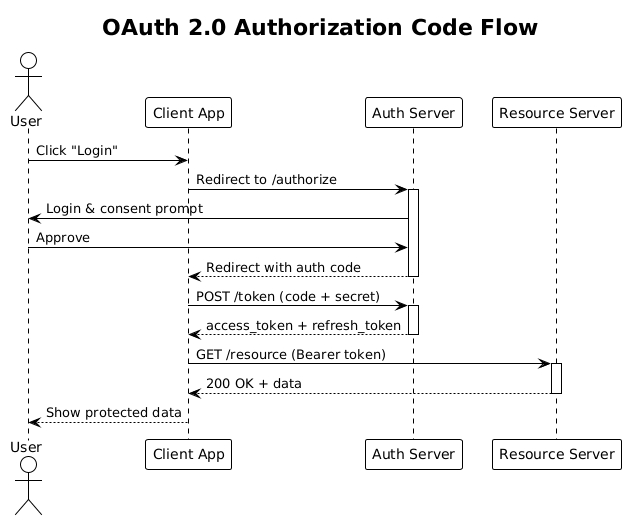
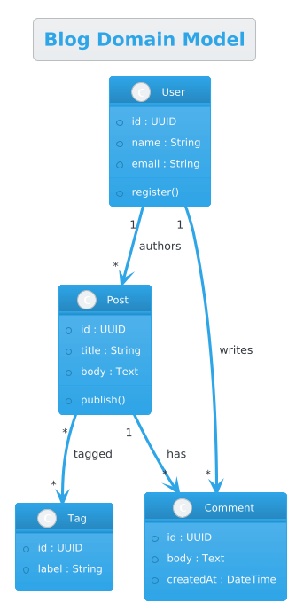
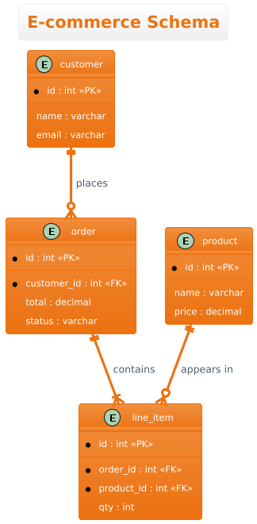
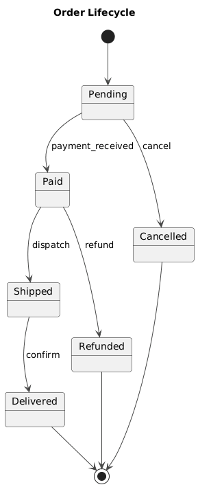
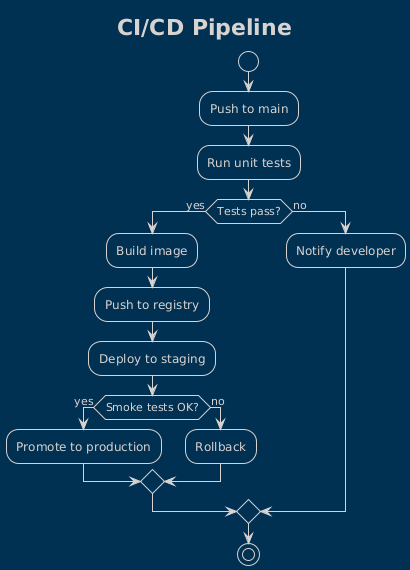
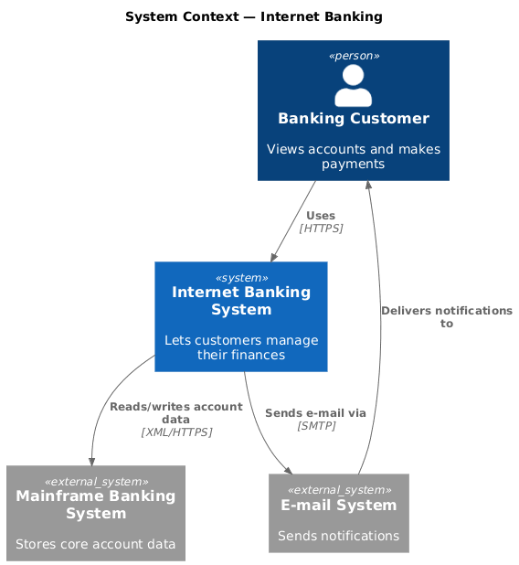

# plantuml-skill — From Text to Professional UML Diagrams

[](LICENSE)
[](https://github.com/Agents365-ai/plantuml-skill/stargazers)
[](https://github.com/Agents365-ai/plantuml-skill/network/members)
[](https://github.com/Agents365-ai/plantuml-skill/releases/latest)
[](https://github.com/Agents365-ai/plantuml-skill/commits/main)

[](https://skillsmp.com/skills/agents365-ai-plantuml-skill-skills-plantuml-skill-skill-md)
[](https://clawhub.ai/agents365-ai/plantuml-pro-skill)
[](https://github.com/Agents365-ai/365-skills)
[](https://agentskills.io)
[](https://discord.gg/79JF5Atuk)

**English** · [中文](README_CN.md) · [📖 Online Docs](https://agents365-ai.github.io/plantuml-skill/)

A skill that turns natural-language descriptions into `.puml` PlantUML source and exports diagrams to PNG / SVG via the [Kroki](https://kroki.io) rendering API — no Java, no Graphviz, no local install (just `curl`). Local Kroki Docker and `plantuml.jar` fallbacks are available for offline / air-gapped use. Works with **Claude Code, Cursor, Copilot, OpenClaw, Codex, Hermes**, and any agent compatible with the [Agent Skills](https://agentskills.io) format.

<p align="center">
  
</p>

## ✨ Highlights

- **10+ diagram types** — sequence, component, class, ER, activity, use case, state, C4, mind map, gantt — each with idiomatic syntax templates and shape vocabulary
- **Zero-install default** — public Kroki API needs only `curl`; no Node, no Java, no Graphviz
- **3 rendering backends** — public Kroki, local Kroki via Docker (offline), or `plantuml.jar` + Java + Graphviz (air-gapped)
- **5 built-in themes** — `plain`, `cerulean`, `blueprint`, `aws-orange`, `vibrant` — plus full `skinparam` overrides
- **C4 that actually works** — uses Kroki's `c4plantuml` endpoint to sidestep the public PlantUML server's `!include` 404 trap
- **Common Mistakes guide** — 9-row curated table covering arrow direction, layout overflow, label escaping, participant ordering, and the C4 include pitfall
- **Vision self-check + review loop** — beyond the syntax/render self-correct loop, reads the exported PNG to catch readability defects auto-layout can't prevent (clipped labels, component overlap, wrong orientation), auto-fixes (≤2 rounds), then iterates with you (≤5 rounds)
- **Beyond text → diagram** — also generates diagrams from existing **source code** (class/sequence/component/ER), and **renders PlantUML embedded in Markdown** to images, rewriting the doc with image links (Confluence / Notion-ready)

## 🖼️ Examples

> [!TIP]
> **The hero image above was generated from this single prompt:**

```
Create a microservices e-commerce architecture with Mobile/Web/Admin clients,
API Gateway, User/Order/Product/Payment services, Kafka event bus,
Notification service, and User DB / Order DB / Product DB / Redis Cache /
Stripe API
```

Source `.puml` and rendered PNG live in [`assets/`](assets/) — the skill produced both in one shot.

### More examples — different types & themes

Six diagram types, each in a different built-in theme — all rendered via Kroki. Sources + PNGs in [`assets/examples/`](assets/examples/).

<table>
  <tr>
    <td align="center"><br><sub><b>Sequence</b> · <code>plain</code></sub></td>
    <td align="center"><br><sub><b>Class</b> · <code>cerulean</code></sub></td>
    <td align="center"><br><sub><b>ER</b> · <code>aws-orange</code></sub></td>
  </tr>
  <tr>
    <td align="center"><br><sub><b>State</b> · <code>vibrant</code></sub></td>
    <td align="center"><br><sub><b>Activity</b> · <code>blueprint</code></sub></td>
    <td align="center"><br><sub><b>C4 Context</b> · <code>&lt;C4/…&gt;</code></sub></td>
  </tr>
</table>

## 🚀 Installation

### 1. Pick a rendering backend

| Option | Install | When to use |
|---|---|---|
| **Kroki API** (default) | `curl` (pre-installed everywhere) | Online — zero setup |
| **Local Kroki** | `docker run -d -p 8000:8000 yuzutech/kroki` | Offline / privacy / heavy workloads |
| **`plantuml.jar`** | `brew install graphviz openjdk` + [download jar](https://plantuml.com/download) | Fully air-gapped |

Full recipes in [docs/setup.md](docs/setup.md).

### 2. Install the skill

```bash
# Any agent (Claude Code, Cursor, Copilot, ...)
npx skills add Agents365-ai/365-skills -g
```

```text
# Claude Code plugin marketplace
> /plugin marketplace add Agents365-ai/365-skills
> /plugin install plantuml
```

```bash
# Manual install
git clone https://github.com/Agents365-ai/plantuml-skill.git \
  ~/.claude/skills/plantuml-skill
```

Common paths: `~/.claude/skills/` (Claude Code), `~/.config/opencode/skills/` (Opencode), `~/.openclaw/skills/` (OpenClaw), `~/.agents/skills/` (Codex). Also indexed on [SkillsMP](https://skillsmp.com/skills/agents365-ai-plantuml-skill-skills-plantuml-skill-skill-md) and [ClawHub](https://clawhub.ai/agents365-ai/plantuml-pro-skill).

**Updating:** `/plugin update plantuml` (Claude Code), `skills update plantuml-skill` (SkillsMP), `clawhub update plantuml-pro-skill` (OpenClaw), or `git pull` for manual installs.

## ⚡ Quick Start

After installation, just describe what you want:

```
Create a sequence diagram showing the OAuth 2.0 authorization code flow with
Client, Authorization Server, Resource Server, and User. Include the redirect,
token exchange, and resource access steps with proper activation boxes.
```

The skill picks the right diagram type, generates the `.puml` source, and exports to PNG/SVG via Kroki.

## 🧩 Supported Diagram Types

| Category | Examples | Notable features |
|---|---|---|
| Sequence | API calls, OAuth flows, protocol traces | Lifelines, activation boxes, async arrows |
| Component / Architecture | services, modules, queues, databases, clouds | `package`/`rectangle` grouping, shape vocabulary |
| Class | OOP models, data structures | Inheritance, composition, aggregation, multiplicities (`"1" --> "*"`) |
| ER / Entity | database schemas | `<<PK>>` / `<<FK>>` notation, crow's-foot relationships |
| Activity / Flowchart | workflows, business processes | `if/then/else/endif` decision branches |
| Use Case | system requirements, user stories | Actors, system boundaries |
| State | state machines, lifecycle flows | `[*] -->` start/end markers |
| C4 | Context, Container, Component | Via Kroki's `c4plantuml` endpoint (no broken includes) |
| Other | mind maps, gantt | `@startmindmap`, `@startgantt` |

## 🔄 How it works

Behind the scenes: **check `curl`** → **pick diagram type** → **generate `.puml` source** with `@startuml`/`@enduml` markers → **POST to Kroki** (`https://kroki.io/plantuml/png` or `…/svg`) → **validate & self-correct the render (fix syntax, ≤3 rounds)** → **vision self-check readability and auto-fix (≤2 rounds)** → **review loop on your feedback (≤5 rounds)** → **save output + report paths**. Swap the endpoint for `http://localhost:8000` to use a local Kroki container, or run `java -jar plantuml.jar` for air-gapped renders.

## 🆚 Comparison

### vs Native Agent (no skill)

| Feature | Native agent | plantuml-skill |
|---|---|---|
| Generate PlantUML source | ✅ (LLMs know the syntax) | ✅ |
| Export to PNG/SVG | ❌ outputs text only | ✅ one `curl` POST to Kroki |
| Self-correct on render error | ❌ ships broken output | ✅ checks HTTP/bytes, fixes syntax, retries (≤3 rounds) |
| Vision self-check + review loop | ❌ never looks at the render | ✅ reads the PNG, auto-fixes readability (≤2), then iterates on feedback (≤5) |
| Renderer choice | none | ✅ public Kroki / local Kroki / `plantuml.jar` |
| Diagram-type catalog | implicit | ✅ 10+ types with shape & arrow vocabulary |
| Theme defaults | random per run | ✅ 5 named themes + `skinparam` overrides |
| C4 via cloud | ❌ often broken (`!include` 404s) | ✅ Kroki `c4plantuml` endpoint |
| Common-mistake guard rails | ❌ | ✅ 9-row curated pitfalls table |
| Offline / air-gapped | ❌ | ✅ local Kroki Docker or local jar |

Full comparison + key-advantages summary in [docs/features.md](docs/features.md).

## 🎯 When to use (and when not to)

**Good fit:**
- Standardized UML — class, sequence, state, component, use-case, activity, deployment, C4
- Diagrams-as-code with automatic layout; ideal for CI pipelines and docs-as-code
- When correct, conventional UML notation matters (hollow inheritance arrows, lifelines, etc.)

**Reach for a sibling skill instead when you need:**
- **General, non-UML quick diagrams embedded in Markdown** → [mermaid-skill](https://github.com/Agents365-ai/mermaid-skill)
- **Freeform, heavily-styled, or branded diagrams with pixel control** → [drawio-skill](https://github.com/Agents365-ai/drawio-skill)
- **A hand-drawn / sketchy look** → [excalidraw-skill](https://github.com/Agents365-ai/excalidraw-skill) or [tldraw-skill](https://github.com/Agents365-ai/tldraw-skill)

## 🔗 Related Skills

Part of the [Agents365-ai diagram-skill family](https://github.com/Agents365-ai) — pick the right tool for the job:

| Skill | Style | Best for |
|---|---|---|
| [drawio-skill](https://github.com/Agents365-ai/drawio-skill) | Professional / vector | Architecture, ML/DL, ER diagrams with self-check loop |
| [excalidraw-skill](https://github.com/Agents365-ai/excalidraw-skill) | Hand-drawn / sketchy | Whiteboard mockups, informal diagrams |
| [mermaid-skill](https://github.com/Agents365-ai/mermaid-skill) | Text-based, auto-layout | README-embeddable, version-control friendly |
| [tldraw-skill](https://github.com/Agents365-ai/tldraw-skill) | Whiteboard collaboration | Casual sketches, FigJam-style boards |

## 💬 Community

- **Discord:** https://discord.gg/79JF5Atuk
- **WeChat:** scan the QR code below

<p align="center">
  
</p>

## ❤️ Support

If this skill helps you, consider supporting the author:

<table>
  <tr>
    <td align="center">
      
      <br>
      <b>WeChat Pay</b>
    </td>
    <td align="center">
      
      <br>
      <b>Alipay</b>
    </td>
    <td align="center">
      
      <br>
      <b>Buy Me a Coffee</b>
    </td>
    <td align="center">
      
      <br>
      <b>Give a Reward</b>
    </td>
  </tr>
</table>

## 👤 Author

**Agents365-ai**

- GitHub: https://github.com/Agents365-ai
- Bilibili: https://space.bilibili.com/441831884

## 📄 License

[MIT](LICENSE)
