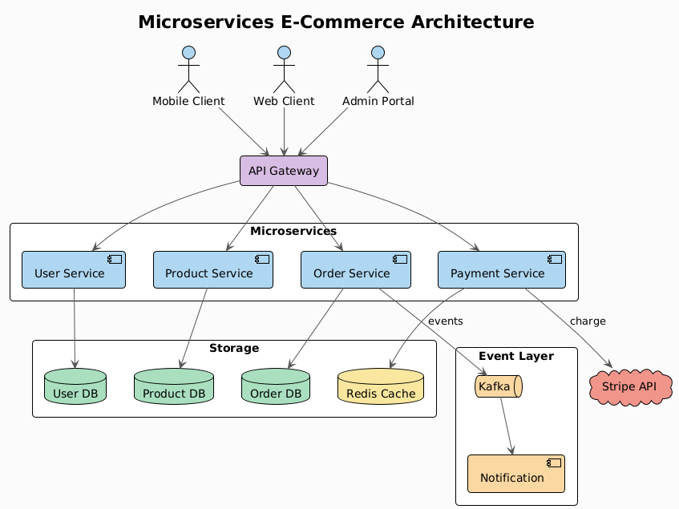

# plantuml-skill —— 从文字到专业 UML 图表

[](LICENSE)
[](https://github.com/Agents365-ai/plantuml-skill/stargazers)
[](https://github.com/Agents365-ai/plantuml-skill/network/members)
[](https://github.com/Agents365-ai/plantuml-skill/releases/latest)
[](https://github.com/Agents365-ai/plantuml-skill/commits/main)

[](https://skillsmp.com/skills/agents365-ai-plantuml-skill-skills-plantuml-skill-skill-md)
[](https://clawhub.ai/agents365-ai/plantuml-pro-skill)
[](https://github.com/Agents365-ai/365-skills)
[](https://agentskills.io)
[](https://discord.gg/79JF5Atuk)

[English](README.md) · **中文** · [📖 在线文档](https://agents365-ai.github.io/plantuml-skill/zh.html)

一个把自然语言描述变成 `.puml` PlantUML 源文件,并通过 [Kroki](https://kroki.io) 渲染 API 导出为 PNG / SVG 的技能 —— 无需 Java、无需 Graphviz、无需本地安装(只要 `curl`)。离线 / 气隙场景可使用本地 Kroki Docker 或 `plantuml.jar`。支持 **Claude Code、Cursor、Copilot、OpenClaw、Codex、Hermes** 等任何兼容 [Agent Skills](https://agentskills.io) 规范的 agent。

<p align="center">
  
</p>

## ✨ 核心亮点

- **10+ 种图表类型** —— 时序图、组件图、类图、ER 图、活动图、用例图、状态图、C4、思维导图、Gantt,每种都带地道语法模板与形状词汇
- **零安装默认值** —— 公共 Kroki API 只需要 `curl`,无需 Node、Java、Graphviz
- **3 种渲染后端** —— 公共 Kroki、本地 Kroki Docker(离线)、`plantuml.jar` + Java + Graphviz(气隙)
- **5 套内置主题** —— `plain`、`cerulean`、`blueprint`、`aws-orange`、`vibrant`,加完整的 `skinparam` 覆盖
- **C4 真的能用** —— 通过 Kroki 的 `c4plantuml` 端点绕开公共 PlantUML 服务器的 `!include` 404 陷阱
- **常见错误指南** —— 精选 9 行表格:箭头方向、布局溢出、标签转义、参与者顺序、C4 include 陷阱等
- **视觉自检 + 评审循环** —— 在语法/渲染自纠循环之外,读取导出的 PNG,捕捉自动布局也防不住的可读性缺陷(标签被截断、组件重叠、方向不当),自动修复(≤2 轮),再根据你的反馈迭代(≤5 轮)

## 🖼️ 示例

> [!TIP]
> **页首那张图就是用下面这条提示词生成的:**

```
画一个微服务电商架构图,包含 Mobile/Web/Admin 客户端、API Gateway、
User/Order/Product/Payment 微服务、Kafka 事件总线、Notification 服务,
以及 User DB / Order DB / Product DB / Redis Cache / Stripe API
```

源 `.puml` 与渲染后的 PNG 都在 [`assets/`](assets/) 里 —— 技能一次产出。

## 🚀 安装

### 1. 选择渲染后端

| 方式 | 安装 | 适用 |
|---|---|---|
| **Kroki API**(默认) | `curl`(全平台预装) | 在线 —— 零配置 |
| **本地 Kroki** | `docker run -d -p 8000:8000 yuzutech/kroki` | 离线 / 隐私 / 高负载 |
| **`plantuml.jar`** | `brew install graphviz openjdk` + [下载 jar](https://plantuml.com/download) | 完全气隙环境 |

完整方案见 [docs/setup_CN.md](docs/setup_CN.md)。

### 2. 安装技能

```bash
# 任意 Agent(Claude Code、Cursor、Copilot 等)
npx skills add Agents365-ai/365-skills -g
```

```text
# Claude Code 插件市场
> /plugin marketplace add Agents365-ai/365-skills
> /plugin install plantuml
```

```bash
# 手动安装
git clone https://github.com/Agents365-ai/plantuml-skill.git \
  ~/.claude/skills/plantuml-skill
```

常用路径:`~/.claude/skills/`(Claude Code)、`~/.config/opencode/skills/`(Opencode)、`~/.openclaw/skills/`(OpenClaw)、`~/.agents/skills/`(Codex)。同时索引于 [SkillsMP](https://skillsmp.com/skills/agents365-ai-plantuml-skill-skills-plantuml-skill-skill-md) 与 [ClawHub](https://clawhub.ai/agents365-ai/plantuml-pro-skill)。

**更新:** `/plugin update plantuml`(Claude Code)、`skills update plantuml-skill`(SkillsMP)、`clawhub update plantuml-pro-skill`(OpenClaw),或 `git pull`(手动安装)。

## ⚡ 快速开始

装好之后直接描述你想要的图表:

```
画一个 OAuth 2.0 授权码流程的时序图,包含 Client、Authorization Server、
Resource Server 和 User。展示跳转、token 交换、资源访问等步骤,
带上正确的激活框。
```

Skill 会自动挑选合适的图表类型,生成 `.puml` 源文件,并通过 Kroki 导出为 PNG/SVG。

## 🧩 支持的图表类型

| 类别 | 示例 | 特色 |
|---|---|---|
| 时序图 | API 调用、OAuth 流程、协议追踪 | 生命线、激活框、异步箭头 |
| 组件 / 架构 | 服务、模块、队列、数据库、云组件 | `package`/`rectangle` 分组、形状词汇 |
| 类图 | OOP 模型、数据结构 | 继承、组合、聚合、多重性(`"1" --> "*"`) |
| ER / 实体 | 数据库 Schema | `<<PK>>` / `<<FK>>` 标记、鱼尾纹关系 |
| 活动 / 流程图 | 工作流、业务流程 | `if/then/else/endif` 分支判断 |
| 用例图 | 系统需求、用户故事 | 角色、系统边界 |
| 状态图 | 状态机、生命周期 | `[*] -->` 起止标记 |
| C4 | Context、Container、Component | 通过 Kroki `c4plantuml` 端点(includes 不会 404) |
| 其他 | 思维导图、Gantt | `@startmindmap`、`@startgantt` |

## 🔄 工作流程

幕后流程:**检查 `curl`** → **挑选图表类型** → **生成 `.puml` 源**(`@startuml`/`@enduml`)→ **POST 到 Kroki**(`https://kroki.io/plantuml/png` 或 `…/svg`)→ **校验并自纠渲染(修语法,≤3 轮)** → **视觉自检可读性并自动修复(≤2 轮)** → **根据你的反馈评审循环(≤5 轮)** → **保存输出 + 上报路径**。把端点改成 `http://localhost:8000` 即用本地 Kroki 容器;`java -jar plantuml.jar` 则用于气隙渲染。

## 🆚 对比

### 对比原生智能体(无 skill)

| 功能 | 原生智能体 | plantuml-skill |
|---|---|---|
| 生成 PlantUML 源码 | ✅(LLM 懂语法) | ✅ |
| 导出 PNG/SVG | ❌ 只能输出文本 | ✅ 一次 `curl` POST 到 Kroki |
| 渲染出错自纠 | ❌ 直接交付坏图 | ✅ 查 HTTP/字节、修语法、重试(≤3 轮) |
| 视觉自检 + 评审循环 | ❌ 从不看渲染结果 | ✅ 读 PNG、自动修可读性(≤2),再按反馈迭代(≤5) |
| 渲染后端可选 | 无 | ✅ 公共 Kroki / 本地 Kroki / `plantuml.jar` |
| 图表类型清单 | 隐式 | ✅ 10+ 种带形状与箭头词汇 |
| 主题默认值 | 每次随机 | ✅ 5 套命名主题 + `skinparam` 覆盖 |
| 云端 C4 | ❌ 常因 `!include` 404 失败 | ✅ 使用 Kroki `c4plantuml` 端点 |
| 常见错误防护 | ❌ | ✅ 9 行精选错误表 |
| 离线 / 气隙 | ❌ | ✅ 本地 Kroki Docker 或本地 jar |

完整对比 + 核心优势见 [docs/features_CN.md](docs/features_CN.md)。

## 🎯 何时用(以及何时别用)

**适合:**
- 规范的 UML —— 类图、时序图、状态图、组件图、用例图、活动图、部署图、C4
- 以代码画图 + 自动布局;非常适合 CI 流水线与 docs-as-code
- 看重正确、规范的 UML 记法(空心继承箭头、生命线等)

**这些情况请改用同系列的其它 skill:**
- **通用的、非 UML 的、嵌入 Markdown 的快速图** → [mermaid-skill](https://github.com/Agents365-ai/mermaid-skill)
- **自由排布、重样式、带品牌图标且要像素级控制的图** → [drawio-skill](https://github.com/Agents365-ai/drawio-skill)
- **手绘 / 潦草观感** → [excalidraw-skill](https://github.com/Agents365-ai/excalidraw-skill) 或 [tldraw-skill](https://github.com/Agents365-ai/tldraw-skill)

## 🔗 相关 Skill

[Agents365-ai 图表 skill 家族](https://github.com/Agents365-ai) 一员 —— 按场景挑工具:

| Skill | 风格 | 适用场景 |
|---|---|---|
| [drawio-skill](https://github.com/Agents365-ai/drawio-skill) | 专业 / 矢量 | 架构图、ML/DL、ER 图,带自检循环 |
| [excalidraw-skill](https://github.com/Agents365-ai/excalidraw-skill) | 手绘 / 草图 | 白板原型、非正式图 |
| [mermaid-skill](https://github.com/Agents365-ai/mermaid-skill) | 文本驱动、自动布局 | 可嵌入 README、易于版本管理 |
| [tldraw-skill](https://github.com/Agents365-ai/tldraw-skill) | 白板协作 | 随手画、FigJam 风格 |

## 💬 社区

- **Discord:** https://discord.gg/79JF5Atuk
- **微信:** 扫描下方二维码

<p align="center">
  
</p>

## ❤️ 支持作者

如果这个 skill 对你有帮助,欢迎支持作者:

<table>
  <tr>
    <td align="center">
      
      <br>
      <b>微信支付</b>
    </td>
    <td align="center">
      
      <br>
      <b>支付宝</b>
    </td>
    <td align="center">
      
      <br>
      <b>Buy Me a Coffee</b>
    </td>
    <td align="center">
      
      <br>
      <b>打赏</b>
    </td>
  </tr>
</table>

## 👤 作者

**Agents365-ai**

- GitHub: https://github.com/Agents365-ai
- Bilibili: https://space.bilibili.com/441831884

## 📄 许可证

[MIT](LICENSE)
